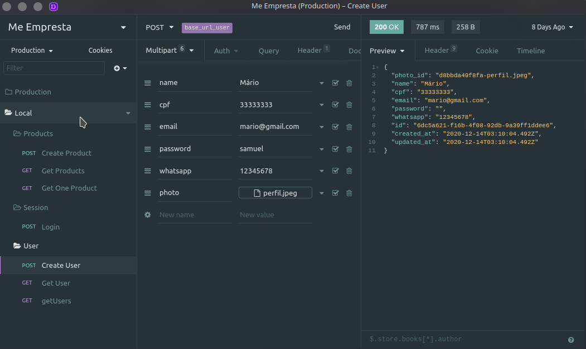
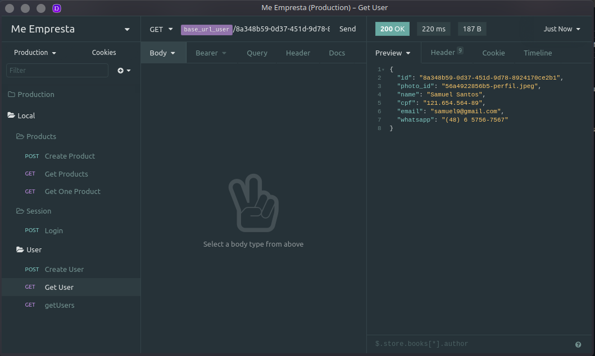

# Me Empresta Back-end

Repositório responsável por armazenar o back-end do Me Empresta, projeto desenvolvido durante a cadeira de Projeto Integrador da Faculdade Senac Pernambuco.

## Me Empresta :fire:

Já pensou na possibilidade de emprestar e pegar emprestado itens do dia a dia? Dê adeus a aquele quartinho da bagunça que apenas acumula itens empoeirados. Com o me empresta você pode emprestá-los e ainda fazer uma renda extra em cima deles.

Imagina as possibilidades?

## Rotas do projeto

  - ## Users
    - ### Create User [POST] <base_url>/user
      
      - Rota deve enviar um Multipart com os seguintes dados para criar um novo usuário na aplicação. É retornado como resposta os dados do usuário recém criado.
    - ### Get Users [GET] <base_url>/user
      

## Tecnologias utilizadas no back :computer:

- NodeJs
- Typescript
- Postgres
- Typeorm
- Docker
- AmazonS3

## Link para site em produçao

[Site Me Empresta](https://meempresta.vercel.app/)

## Como rodar o projeto na sua casa

1. Clone o repositório
1. Execute o comando `npm install` para instalar todas as dependências
1. Crie um arquivo `.env` com todos as informações de banco requisitadas no arquivo `ormmconfig.js`.
1. Crie um banco de dados postgres na sua mágina local com nome definido no .env.
1. Execute o comando `npm start` para iniciar o servidor
1. Utilize o seu testador de rotas para fazer as requisições as rotas.

##### Com amor :heart: Samuel Santos
