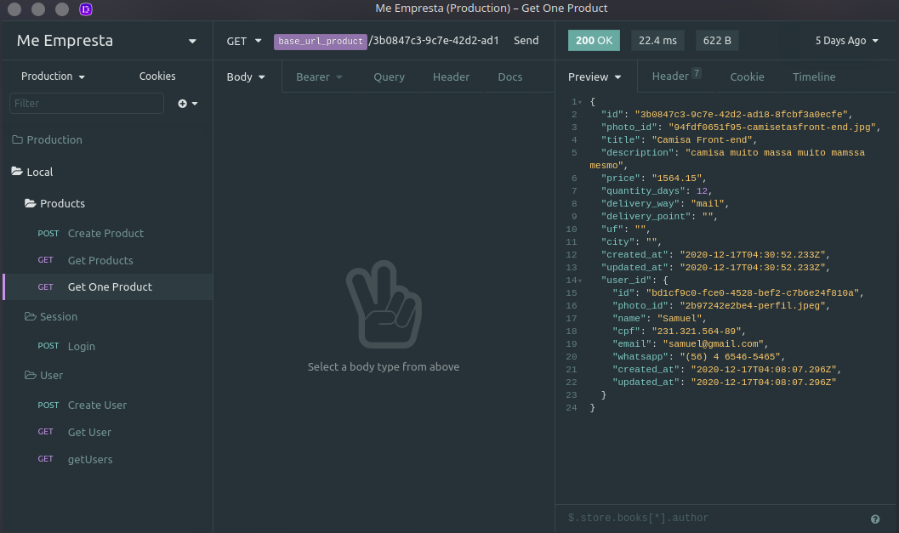

# Me Empresta Back-end

Repositório responsável por armazenar o back-end do Me Empresta, projeto desenvolvido durante a cadeira de Projeto Integrador da Faculdade Senac Pernambuco.

## Me Empresta :fire:

Já pensou na possibilidade de emprestar e pegar emprestado itens do dia a dia? Dê adeus a aquele quartinho da bagunça que apenas acumula itens empoeirados. Com o me empresta você pode emprestá-los e ainda fazer uma renda extra em cima deles.

Imagina as possibilidades?

## Rotas do projeto

  - ## Users
    - ### Create User [POST] <base_url>/user
      
      - Rota deve enviar um Multipart com os seguintes dados para criar um novo usuário na aplicação. É retornado como resposta os dados do usuário recém criado.
    - ### Get Users [GET] <base_url>/user || Header => Authorization: Bearer token
      
      - Rota retorna todos os usuários cadastrados na aplicação.
    - ### Get User [GET] <base_url>/user/<string:id> || Header => Authorization: Bearer token
      
      - Rota retorna um único usuário com base no ID.

  - ## Sessions
    - ### Login [POST] <base_url>/session
      
      - Rota que cria uma nova sessão para o usuário retornando o token JWT que será utilizado em todas as requisições protegidas e o userId do usuário.

  - ## Products
    - ### Create Product [POST] <base_url>/product || Header => Authorization: Bearer token
      
      - Rota responsável por criar um novo produto. Nela deve ser passado no body um MultipartForm com esses dados informados. Os campos de `delivery_point`, `uf`, e `city` só devem ser preenchidos caso o `delivery_way` seja presential.

    - ### Get Products [GET] <base_url>/product
      
      -  Rota responsável por mostrar todos os produtos cadastrados na plataforma.

    - ### Get Product [GET] <base_url>/product/<string: id>
      
      - Rota responsável por mostrar apenas um  produto de acordo com o id informado no query params.

## Tecnologias utilizadas no back :computer:

- NodeJs
- Typescript
- Postgres
- Typeorm
- Docker
- AmazonS3

## Link para site em produçao

[Site Me Empresta](https://meempresta.vercel.app/)

## Como rodar o projeto na sua casa

1. Clone o repositório
1. Execute o comando `npm install` para instalar todas as dependências
1. Crie um arquivo `.env` com todos as informações de banco requisitadas no arquivo `ormmconfig.js`.
1. Crie um banco de dados postgres na sua mágina local com nome definido no .env.
1. Execute o comando `npm start` para iniciar o servidor
1. Utilize o seu testador de rotas para fazer as requisições as rotas.

##### Com amor :heart: Samuel Santos
